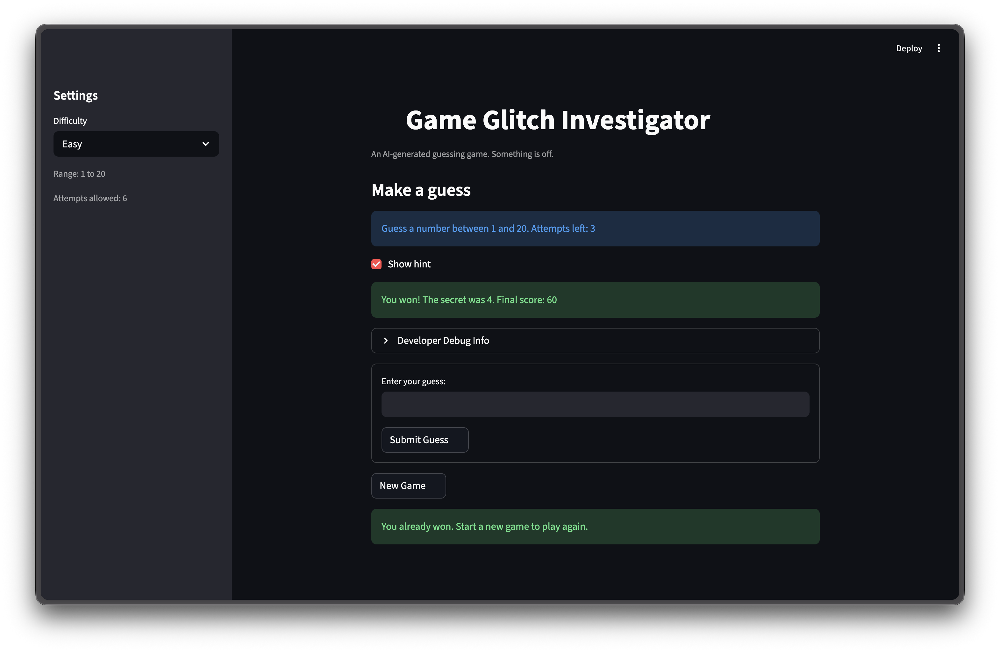
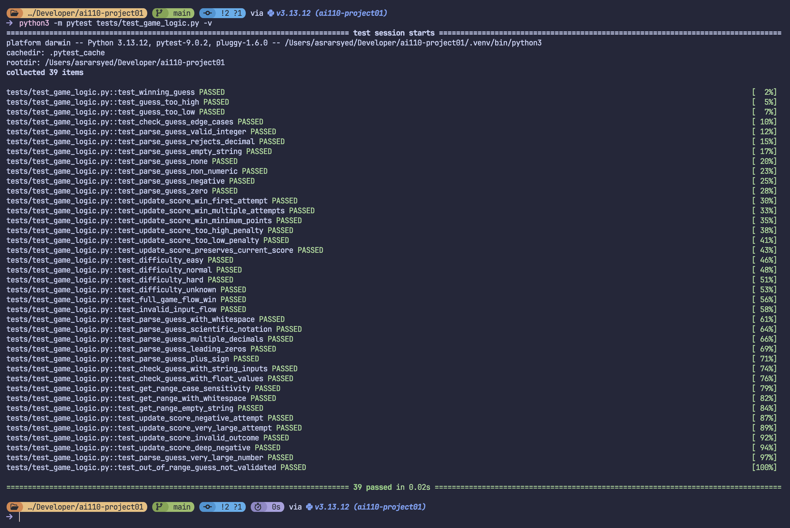

# 🎮 Game Glitch Investigator: The Impossible Guesser

## 🚨 The Situation

You asked an AI to build a simple "Number Guessing Game" using Streamlit.
It wrote the code, ran away, and now the game is unplayable. 

- You can't win.
- The hints lie to you.
- The secret number seems to have commitment issues.

## 🛠️ Setup

1. Install dependencies: `pip install -r requirements.txt`
2. Run the broken app: `python -m streamlit run app.py`

## 🕵️‍♂️ Your Mission

1. **Play the game.** Open the "Developer Debug Info" tab in the app to see the secret number. Try to win.
2. **Find the State Bug.** Why does the secret number change every time you click "Submit"? Ask ChatGPT: *"How do I keep a variable from resetting in Streamlit when I click a button?"*
3. **Fix the Logic.** The hints ("Higher/Lower") are wrong. Fix them.
4. **Refactor & Test.** - Move the logic into `logic_utils.py`.
   - Run `pytest` in your terminal.
   - Keep fixing until all tests pass!

## 📝 Document Your Experience

- [X] Describe the game's purpose.
- [X] Detail which bugs you found.
- [X] Explain what fixes you applied.

Game Glitch Investigator is a number-guessing web app built with Streamlit where the player tries to guess a randomly generated secret number within a limited number of attempts. It has builtin hints directing them higher or lower after each guess, difficulty settings control the number range and attempt limit, and a score tracks performance across rounds.

The bugs I found fell into several categories: hint directions were reversed (guessing too high showed "Go HIGHER!" and vice versa), the attempt counter started at 1 instead of 0 causing an off-by-one error that made one attempt disappear, empty guesses consumed attempts despite showing a warning, type-mixing on even attempts compared the guess against a stringified secret number causing inconsistent results, the New Game button ignored the selected difficulty and always reset to range 1–100, and a Streamlit lifecycle issue caused hints and the attempt count to render out of sync (hint appeared with the stale count from the previous rerun).

All game logic was refactored out of app.py into logic_utils.py, introducing four helper functions: parse_guess, check_guess, update_score, and get_range_for_difficulty. From there, several bugs were corrected: the hint direction logic was reversed, the attempt counter was initialized incorrectly, and empty or non-integer guesses were consuming attempts without being validated. The New Game reset path was also updated to respect the selected difficulty. Finally, the inline st.text_input + st.button pattern was replaced with st.form, which batches submissions into a single rerun; feedback is now stored in st.session_state so the hint and updated attempt count render together on the next cycle.

## 📸 Demo Walkthrough

Describe your fixed game in numbered steps so a reader can follow along without watching a video:

1. Start the app and select a difficulty (Easy, Normal, or Hard). The game tells you the number range and how many attempts you get.
2. Type a guess in the box and click Submit Guess (or press Enter). The app shows a hint like "Go HIGHER" or "Go LOWER" that correctly tells you which direction the secret number is.
3. Keep guessing based on the hints. The Attempts counter goes down by 1 each time, and the History shows all your previous guesses.
4. Win the game by guessing the secret number correctly. Your score increases based on how many attempts it took (fewer attempts = more points).
5. Click the New Game button to start fresh with a new secret number. All counters reset but your total score carries over to the next round.

**Screenshot** *(optional)*: <!-- Insert a screenshot of your fixed, winning game here -->

## 🧪 Test Results

## 🚀 Stretch Features

- [X] Challenge 1: Advanced Edge-Case Testing
- [ ] Challenge 2: Feature Expansion via Agent Mode
- [ ] Challenge 3: Professional Documentation and Linting
- [ ] Challenge 4: Enhanced Game UI (If you choose to complete Challenge 4, describe them here — a screenshot is optional)
- [X] Challenge 5: AI Model Comparison